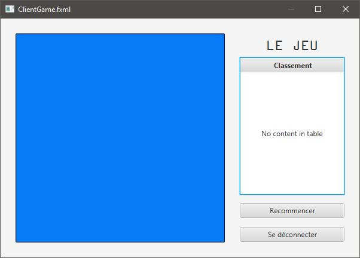

# HEIG-VD - GEN 2017 - Jeu de réflexe en multijoueur

Abass Mahdavi, Denise Gemesio, Luca Sivillica & Ludovic Delafontaine

## But du jeu
Le jeu se compose d'une surface interactive sur laquelle il est possible de déplacer la souris et cliquer. Le but est de tester les réflexes de différents joueurs connectés en réseau au jeu avec plusieurs modes décrits ci-dessous. L'architecture du jeu est de type client-serveur. Le serveur gère la communication entre les différents clients, les scores de chacun ainsi que les spécificités des différents modes de jeu.

# Fonctionnement du programme
Un groupe d'amis souhaite jouer à notre jeu. Ils se réunissent sur le même réseau local et démarre le serveur.

Le serveur permet la configuration de la partie selon plusieurs options et envies de chacun. La partie est lancée et le serveur se met en attente du nombre de joueurs requis. De plus, le serveur, qui joue le rôle d'administrateur, permet de nettoyer la base de données des scores enregistrés.

Les joueurs démarrent leur client et saissent l'adresse IP du serveur.

Ils choissent un pseudonyme qui les identifie et rejoigne la partie, ce qui ouvre une nouvelle fenêtre avec le nombre de joueurs actuellement connectés par rapport au nombre de joueurs nécessaires.

Une fois le nombre requis de joueurs nécessaire, le serveur lance la partie et le jeu commence.

Selon le mode de jeu choisi, les objets et leurs actions associées modifient le comportement du jeu et les joueurs doivent rapporter le maximum de points. Le jeu se termine lorsqu'un certain score est atteint ou s'il ne reste qu'un joueur en jeu.

Une fois la partie terminée, les joueurs sont invités à recommencer la partie ou quitter le jeu.

## Fonctionnalités importantes
* Enregistrer et visualiser le score des joueurs

### Fonctionnalités propre au serveur / administrateur
* Configuration des modes de jeu
* Lancer la partie
* Attente de connexion des joueurs
* Dès que le nombre de joueurs requis est atteint, la partie se lance
* Mettre fin à la partie prématurément
* Remise des scores contenus dans la base de données des joueurs à zéro
* Modes de jeu
    * First to click: un objet apparaît après un temps aléatoire sur la surface et le premier joueur qui arrive à cliquer sur l'objet gagne. Plusieurs options peuvent être activées pour ce mode:
        * Objets avec bonus
        * Objets avec malus
        * Objets mystère \(soit bonus soit malus\)

### Côté client / joueur
* Spécifier notre pseudo
* Rejoindre une partie
* Jouer la partie
* Voir le score des différents joueurs pendant le jeu
* Quitter la partie (note: la partie en cours n'est pas interrompue. Le joueur est considéré comme ayant perdu)

## Fonctionnalités optionnelles
### Côté serveur / administrateur
* Modes de jeu
    * Memory: des objets apparaissent dans un ordre défini une première fois, la seconde fois qu'ils apparaissent dans le même ordre, il faut s'en souvenir pour cliquer le plus rapidement possible.
    * Find your path: tous les joueurs commencent au même endroit et doivent traverser un labyrinthe le plus rapidement possible sans toucher les bords.
    * Can't escape: des objets se déplacent sur la surface et il faut les éviter. Plusieurs options peuvent être activées pour ce mode:
        * Les objets changent de couleur
    * Inverted: la direction de la souris est inversée: aller vers le haut va vers le bas, aller vers la gauche va vers la droite, etc.

### Côté client / joueur
* Ajout de sonorités

## Contraintes techniques
* Afin de jouer, il est nécessaire d'être connecté à un réseau local
* Tous les joueurs doivent être connectés au même réseau local
* Être conscient de la latence sur le réseau entre les clients et serveurs
* Réduire au maximum les communications entre le client et le serveur pour avoir le moins de latence possible
* Envoyer l'information aux joueurs en même temps

## Contraintes de jeu
* Avoir un pseudo
* Un nombre défini de joueurs pour pouvoir jouer

## Priorités de développement
* Protocole de communication
    * Connexion client-serveur
    * Transmission des règles du jeu
* Base de données
    * Enregistrement des différents scores et remise à zéro de ces derniers
* Interface utilisateur
    * Réactivité correcte
    * Apparition des différents objets
    * Actions liées aux différents objets

## Cas d'utilisation

## Protocole d'échange entre le client et serveur
Notre application communiquera à travers le réseau en utilisant le protocole suivant.

## Modèles de domaine

## Base de données
La base de données servira à stocker les scores des différents joueurs pour chacun des modes auxquels il aurait jouer. La base de données est illustrée avec le schéma suivant.

## Rôles des participants

## Plan d'itération

|  Itération  |       Description        | Semaines |
|-------------|:------------------------:|:--------:|
| Itération 1 |"Joindre une partie"      |     1    |
| Itération 2 |"Configurer une partie"   |    2-3   | 
| Itération 3 |"Lancer une partie"       |     4    |
| Itération 4 |"Jouer une partie"        |    5-6   |
| Itération 5 |"Réinitialiser les scores"|     7    |
| Itération 6 |"Mettre fin à une partie" |     8    |
